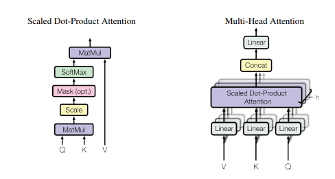
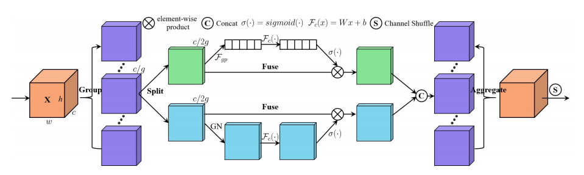
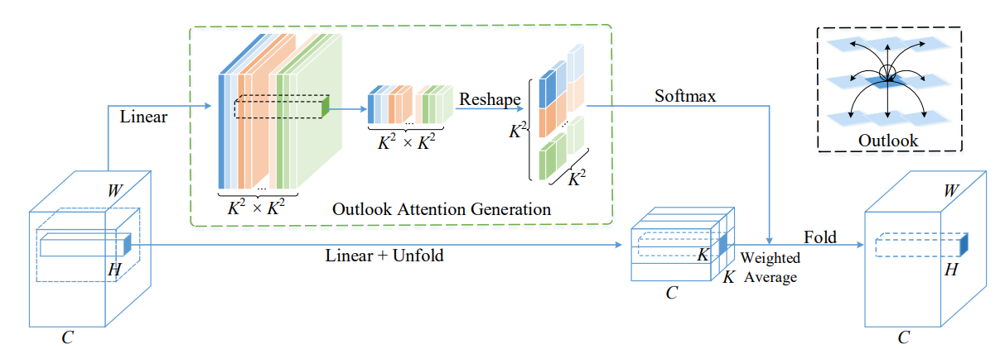
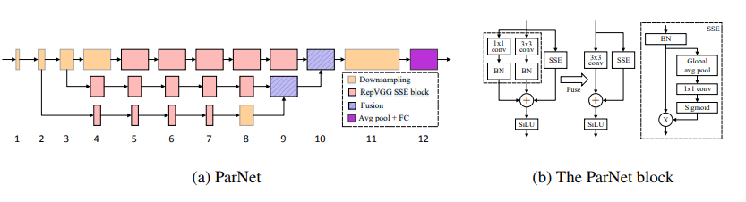
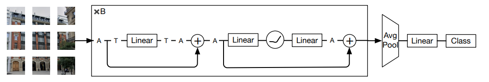
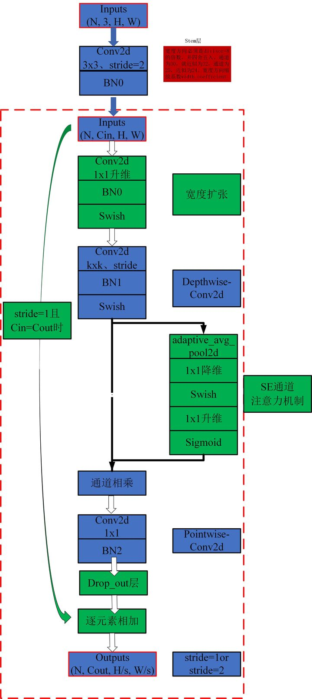
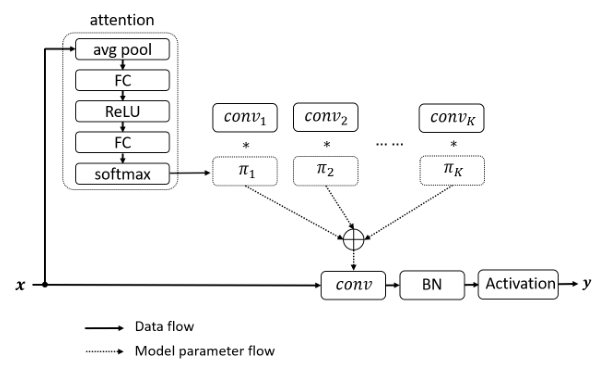

# Content

- [Attention Mechanisms](#Attention-mechanisms)
    - [1. Squeeze-and-Excitation Attention](#1-squeeze-and-excitation-attention)
    - [2. Convolutional Block Attention Module](#2-convolutional-block-attention-module)
    - [3. Bottleneck Attention Module](#3-Bottleneck-Attention-Module)
    - [4. Double Attention](#4-Double-Attention)
    - [5. Style Attention](#5-Style-Attention)
    - [6. Global Context Attention](#6-Global-Convtext-Attention)
    - [7. Selective Kernel Attention](#7-Selective-Kernel-Attention)
    - [8. Linear Context Attention](#8-Linear-Context-Attention)
    - [9. Gated Channel Attention](#9-gated-channel-attention)
    - [10. Efficient Channel Attention](#10-efficient-channel-attention)
    - [11. Triplet Attention](#11-Triplet-Attention)
    - [12. Gaussian Context Attention](#12-Gaussian-Context-Attention)
    - [13. Coordinate Attention](#13-coordinate-attention)
    - [14. SimAM](#14-SimAM)
    - [15. Dual Attention](#15-dual-attention)
    - [16. A2 Attention](#16-a2-attention-usage)
    - [17. External Attention Usage](#17-external-attention-usage)
    - [18. Self Attention Usage](#18-self-attention-usage)
    - [19. Simplified Self Attention Usage](#19-simplified-self-attention-usage)
    - [20. DANet Attention Usage](#20-danet-attention-usage)
    - [21. Pyramid Split Attention (PSA) Usage](#21-Pyramid-Split-Attention-Usage)
    - [22. Efficient Multi-Head Self-Attention(EMSA) Usage](#22-Efficient-Multi-Head-Self-Attention-Usage)
    - [23. Shuffle Attention Usage](#23-Shuffle-Attention-Usage)
    - [24. MUSE Attention Usage](#24-MUSE-Attention-Usage)
    - [25. SGE Attention Usage](#25-SGE-Attention-Usage)
    - [26. AFT Attention Usage](#26-AFT-Attention-Usage)
    - [27. Outlook Attention Usage](#27-Outlook-Attention-Usage)
    - [28. ViP Attention Usage](#28-ViP-Attention-Usage)
    - [29. CoAtNet Attention Usage](#29-CoAtNet-Attention-Usage)
    - [30. HaloNet Attention Usage](#30-HaloNet-Attention-Usage)
    - [31. Polarized Self-Attention Usage](#31-Polarized-Self-Attention-Usage)
    - [32. CoTAttention Usage](#32-CoTAttention-Usage)
    - [33. Residual Attention Usage](#33-Residual-Attention-Usage)
    - [34. S2 Attention Usage](#34-S2-Attention-Usage)
    - [35. GFNet Attention Usage](#35-GFNet-Attention-Usage)
    - [36. MobileViT Attention Usage](#36-MobileViT-Attention-Usage)
    - [37. ParNet Attention Usage](#37-ParNet-Attention-Usage)
    - [38. UFO Attention Usage](#38-UFO-Attention-Usage)
    - [39. ACmix Attention Usage](#39-Acmix-Attention-Usage)
    - [40. MobileViTv2 Attention Usage](#40-MobileViTv2-Attention-Usage)
    - [41. DAT Attention Usage](#41-DAT-Attention-Usage)
    - [42. CrossFormer Attention Usage](#42-CrossFormer-Attention-Usage)
    - [43. MOATransformer Attention Usage](#43-MOATransformer-Attention-Usage)
    - [44. CrissCrossAttention Attention Usage](#44-CrissCrossAttention-Attention-Usage)
    - [45. Axial_attention Attention Usage](#45-Axial_attention-Attention-Usage)
 
- [Vision Transformers](#vision-transformers)
    - [1. ViT Model](#1-ViT-Model)
    - [2. XCiT Model](#2-XCiT-model)
    - [3. PiT Model](#3-pit-model)
    - [4. CvT Model](#4-cvt-model)
    - [5. PvT Model](#5-pvt-model)
    - [6. CMT Model](#6-cmt-model)
    - [7. PoolFormer Model](#7-poolformer-model)
    - [8. KVT Model](#8-kvt-model)
    - [9. MobileViT Model](#9-mobilevit-model)
    - [10. P2T Model](#10-p2t-model)
    - [11. EfficientFormer Model](#11-EfficientFormer-Model)
    - [12. ShiftViT Model](#12-shiftvit-model)
    - [13. CSWin Model](#13-CSWin-Model)
    - [14. DilateFormer Model](#14-DilateFormer-Model)
    - [15. BViT Model](#15-bvit-model)
    - [16. MOAT Model](#16-moat-model)
    - [17. SegFormer Model](#17-segformer-model)
    - [18. SETR Model](#18-setr-model)

- [Convolutional Neural Networks(CNNs)](#convolutional-neural-networks(cnns))
    - [1. NiN Model](#1-nin-model)
    - [2. ResNet Model](#2-resnet-model)
    - [3. WideResNet Model](#3-wideresnet-model)
    - [4. DenseNet Model](#4-densenet-model)
    - [5. PyramidNet Model](#5-pyramidnet-model)
    - [6. MobileNetV1 Model](#6-mobilenetv1-model)
    - [7. MobileNetV2 Model](#7-mobilenetv2-model)
    - [8. MobileNetV3 Model](#8-mobilenetv3-model)
    - [9. MnasNet Model](#9-mnasnet-model)
    - [10. EfficientNetV1 Model](#10-efficientnetv1-model)
    - [11. Res2Net Model](#11-res2net-model)
    - [12. MobileNeXt Model](#12-mobilenext-model)
    - [13. GhostNet Model](#13-ghostnet-model)
    - [14. EfficientNetV2 Model](#14-efficientnetv2-model)
    - [15. ConvNeXt Model](#15-convnext-model)
    - [16. Unet Model](#16-unet-model)
    - [17. ESPNet Model](#17-espnet-model)
    - [18. ResNeXt Usage](#18-ResNeXt-Usage)
    - [19. MobileViT Usage](#19-MobileViT-Usage)
    - [20. ConvMixer Usage](#20-ConvMixer-Usage)
    - [21. ShuffleTransformer Usage](#21-ShuffleTransformer-Usage)
    - [22. ConTNet Usage](#22-ConTNet-Usage)
    - [23. HATNet Usage](#23-HATNet-Usage)
    - [24. CoaT Usage](#24-CoaT-Usage)
    - [25. PVT Usage](#25-PVT-Usage)
    - [26. CPVT Usage](#26-CPVT-Usage)
    - [27. PIT Usage](#27-PIT-Usage)
    - [28. CrossViT Usage](#28-CrossViT-Usage)
    - [29. TnT Usage](#29-TnT-Usage)
    - [30. DViT Usage](#30-DViT-Usage)
    - [31. CeiT Usage](#31-CeiT-Usage)
    - [32. ConViT Usage](#32-ConViT-Usage)
    - [33. CaiT Usage](#33-CaiT-Usage)
    - [34. PatchConvnet Usage](#34-PatchConvnet-Usage)
    - [35. DeiT Usage](#35-DeiT-Usage)
    - [36. LeViT Usage](#36-LeViT-Usage)
    - [37. VOLO Usage](#37-VOLO-Usage)
    - [38. Container Usage](#38-Container-Usage)
    - [39. CMT Usage](#39-CMT-Usage)
    - [40. EfficientFormer Usage](#40-EfficientFormer-Usage)
    - [41. ConvNeXtV2 Usage](#41-ConvNeXtV2-Usage)
    
- [MLP-Like Models](#mlp-like-models)
    - [1. MLP-Mixer Model](#1-mlp-mixer-model)
    - [2. gMLP Model](#2-gmlp-model)
    - [3. GFNet Model](#3-gfnet-model)
    - [4. sMLP Model](#4-smlp-model)
    - [5. DynaMixer Model](#5-dynamixer-model)
    - [6. ConvMixer Model](#6-convmixer-model)
    - [7. ViP Model](#7-vip-model)
    - [8. CycleMLP Model](#8-cyclemlp-model)
    - [9. Sequencer Model](#9-sequencer-model)
    - [10. MobileViG Model](#10-mobilevig-model)
    - [11. RepMLP Usage](#11-RepMLP-Usage)
    - [12. ResMLP Usage](#12-ResMLP-Usage)

- [Re-Parameter(ReP) Series](#Re-Parameter-series)
    - [1. RepVGG Usage](#1-RepVGG-Usage)
    - [2. ACNet Usage](#2-ACNet-Usage)
    - [3. Diverse Branch Block(DDB) Usage](#3-Diverse-Branch-Block-Usage)

- [Convolution Series](#Convolution-series)
    - [1. Depthwise Separable Convolution Usage](#1-Depthwise-Separable-Convolution-Usage)
    - [2. MBConv Usage](#2-MBConv-Usage)
    - [3. Involution Usage](#3-Involution-Usage)
    - [4. DynamicConv Usage](#4-DynamicConv-Usage)

***


## Attention Mechanisms
### 1. Squeeze-and-Excitation Attention
* #### Squeeze-and-Excitation Networks (CVPR 2018) [pdf](https://arxiv.org/pdf/1709.01507)
* ##### Model Overview


* ##### Code
```python
import torch
from Attentions.se_module import SELayer

x = torch.randn(2, 64, 32, 32)
attn = SELayer(64)
y = attn(x)
print(y.shape)

```
### 2. Convolutional Block Attention Module
* #### CBAM: convolutional block attention module (ECCV 2018) [pdf](https://openaccess.thecvf.com/content_ECCV_2018/papers/Sanghyun_Woo_Convolutional_Block_Attention_ECCV_2018_paper.pdf)
* ##### Model Overview


* ##### Code
```python
import torch
from Attentions.cbam import CBAM

x = torch.randn(2, 64, 32, 32)
attn = CBAM(64)
y = attn(x)
print(y.shape)
```
### 3. Bottleneck Attention Module
* #### Bam: Bottleneck attention module(BMVC 2018) [pdf](http://bmvc2018.org/contents/papers/0092.pdf)
* ##### Model Overview


* ##### Code
```python
import torch
from Attentions.bam import BAM

x = torch.randn(2, 64, 32, 32)
attn = BAM(64)
y = attn(x)
print(y.shape)
```
### 4. Double Attention
* #### A2-nets: Double attention networks (NeurIPS 2018) [pdf](https://arxiv.org/pdf/1810.11579)
* ##### Model Overview


* ##### Code
```python
import torch
from Attentions.double_attention import DoubleAttention

x = torch.randn(2, 64, 32, 32)
attn = DoubleAttention(64, 32, 32)
y = attn(x)
print(y.shape)
```

### 5. Style Attention
* #### Srm : A style-based recalibration module for convolutional neural networks (ICCV 2019)  [pdf](https://arxiv.org/pdf/1903.10829)
* ##### Model Overview


* ##### Code
```python
import torch
from Attentions.srm import SRM

x = torch.randn(2, 64, 32, 32)
attn = SRM(64)
y = attn(x)
print(y.shape)
```
### 6. Global Context Attention
* #### Gcnet: Non-local networks meet squeeze-excitation networks and beyond (ICCVW 2019) [pdf](https://arxiv.org/pdf/1904.11492)
* ##### Model Overview


* ##### Code
```python
import torch
from Attentions.gc_module import GCModule

x = torch.randn(2, 64, 32, 32)
attn = GCModule(64)
y = attn(x)
print(y.shape)
```
### 7. Selective Kernel Attention

* #### Selective Kernel Networks (CVPR 2019) [pdf](https://arxiv.org/abs/1903.06586)
* ##### Model Overview


* ##### Code
```python
import torch
from Attentions.sk_module import SKLayer

x = torch.randn(2, 64, 32, 32)
attn = SKLayer(64)
y = attn(x)
print(y.shape)
```
### 8. Linear Context Attention
* #### Linear Context Transform Block (AAAI 2020) [pdf](https://arxiv.org/pdf/1909.03834v2)
* ##### Model Overview


* ##### Code
```python
import torch
from Attentions.lct import LCT

x = torch.randn(2, 64, 32, 32)
attn = LCT(64, groups=8)
y = attn(x)
print(y.shape)
```
### 9. Gated Channel Attention
* #### Gated Channel Transformation for Visual Recognition (CVPR 2020) [pdf](http://openaccess.thecvf.com/content_CVPR_2020/papers/Yang_Gated_Channel_Transformation_for_Visual_Recognition_CVPR_2020_paper.pdf)
* ##### Model Overview


* ##### Code
```python
import torch
from Attentions.gate_channel_module import GCT

x = torch.randn(2, 64, 32, 32)
attn = GCT(64)
y = attn(x)
print(y.shape)
```
### 10. Efficient Channel Attention
* #### Ecanet: Efficient channel attention for deep convolutional neural networks (CVPR 2020) [pdf](https://arxiv.org/pdf/1910.03151)
* ##### Model Overview


* ##### Code
```python
import torch
from Attentions.eca import ECALayer

x = torch.randn(2, 64, 32, 32)
attn = ECALayer(64)
y = attn(x)
print(y.shape)
```
### 11. Triplet Attention

* #### Rotate to Attend: Convolutional Triplet Attention Module (WACV 2021) [pdf](http://arxiv.org/pdf/2010.03045)
* ##### Model Overview


* ##### Code
```python
import torch
from Attentions.TripletAttention import TripletAttention

x = torch.randn(2, 64, 32, 32)
attn = TripletAttention(64)
y = attn(x)
print(y.shape)
```
### 12. Gaussian Context Attention
* #### Gaussian Context Transformer (CVPR 2021) [pdf](http://openaccess.thecvf.com//content/CVPR2021/papers/Ruan_Gaussian_Context_Transformer_CVPR_2021_paper.pdf)
* ##### Model Overview


* ##### Code
```python
import torch
from Attentions.gct import GCT

x = torch.randn(2, 64, 32, 32)
attn = GCT(64)
y = attn(x)
print(y.shape)
```
### 13. Coordinate Attention

* #### Coordinate Attention for Efficient Mobile Network Design (CVPR 2021) [pdf](https://arxiv.org/abs/2103.02907)
* ##### Model Overview


* ##### Code
```python
import torch
from Attentions.coordatten import CoordinateAttention

x = torch.randn(2, 64, 32, 32)
attn = CoordinateAttention(64, 64)
y = attn(x)
print(y.shape)
```
### 14. SimAM
* SimAM: A Simple, Parameter-Free Attention Module for Convolutional Neural Networks (ICML 2021) [pdf](http://proceedings.mlr.press/v139/yang21o/yang21o.pdf)
* ##### Model Overview


* ##### Code
```python
import torch
from Attentions.simam import simam_module

x = torch.randn(2, 64, 32, 32)
attn = simam_module(64)
y = attn(x)
print(y.shape)
```
### 15. Dual Attention
* #### Dual Attention Network for Scene Segmentatio (CVPR 2019)  [pdf](https://arxiv.org/pdf/1809.02983.pdf)
* ##### Model Overview


* ##### Code
```python
import torch
from Attentions.DualAttention import PAM, CAM

x = torch.randn(2, 64, 32, 32)
#attn = PAM(64)
attn = CAM()
y = attn(x)
print(y.shape)
```

### 16. A2 Attention Usage

#### 16.1. Paper
[A2-Nets: Double Attention Networks](https://arxiv.org/pdf/1810.11579.pdf)

#### 16.2. Overview


#### 16.3. Usage Code

```python
from Attentions.A2Attention import DoubleAttention
import torch
from torch import nn
from torch.nn import functional as F

input = torch.randn(50, 512, 7, 7)
a2 = DoubleAttention(512, 128, 128, True)
output = a2(input)
print(output.shape)
```
### 17. External Attention Usage
#### 17.1. Paper
["Beyond Self-attention: External Attention using Two Linear Layers for Visual Tasks"](https://arxiv.org/abs/2105.02358)

#### 17.2. Overview


#### 17.3. Usage Code

```python
from Attentions.ExternalAttention import ExternalAttention
import torch

input = torch.randn(50, 49, 512)
ea = ExternalAttention(d_model=512, S=8)
output = ea(input)
print(output.shape)
```

***


### 18. Self Attention Usage
#### 18.1. Paper
["Attention Is All You Need"](https://arxiv.org/pdf/1706.03762.pdf)

#### 18.2. Overview



#### 18.3. Usage Code

```python
from Attentions.SelfAttention import ScaledDotProductAttention
import torch

input = torch.randn(50, 49, 512)
sa = ScaledDotProductAttention(d_model=512, d_k=512, d_v=512, h=8)
output = sa(input, input, input)
print(output.shape)
```

***

### 19. Simplified Self Attention Usage
#### 19.1. Paper
[None]()

#### 19.2. Overview


#### 19.3. Usage Code

```python
from Attentions.SimplifiedSelfAttention import SimplifiedScaledDotProductAttention
import torch

input = torch.randn(50, 49, 512)
ssa = SimplifiedScaledDotProductAttention(d_model=512, h=8)
output = ssa(input, input, input)
print(output.shape)

```
***

### 20. DANet Attention Usage
#### 20.1. Paper
["Dual Attention Network for Scene Segmentation"](https://arxiv.org/pdf/1809.02983.pdf)

#### 20.2. Overview


#### 20.3. Usage Code

```python
from Attentions.DANet import DAModule
import torch

input = torch.randn(50, 512, 7, 7)
danet = DAModule(d_model=512, kernel_size=3, H=7, W=7)
print(danet(input).shape)

```

***

### 21. Pyramid Split Attention Usage

#### 21.1. Paper
["EPSANet: An Efficient Pyramid Split Attention Block on Convolutional Neural Network"](https://arxiv.org/pdf/2105.14447.pdf)

#### 21.2. Overview


#### 21.3. Usage Code

```python
from Attentions.PSA import PSA
import torch

input = torch.randn(50, 512, 7, 7)
psa = PSA(channel=512, reduction=8)
output = psa(input)
print(output.shape)

```

***


### 22. Efficient Multi-Head Self-Attention Usage

#### 22.1. Paper
["ResT: An Efficient Transformer for Visual Recognition"](https://arxiv.org/abs/2105.13677)

#### 22.2. Overview


#### 22.3. Usage Code

```python

from Attentions.EMSA import EMSA
import torch
from torch import nn
from torch.nn import functional as F

input = torch.randn(50, 64, 512)
emsa = EMSA(d_model=512, d_k=512, d_v=512, h=8, H=8, W=8, ratio=2, apply_transform=True)
output = emsa(input, input, input)
print(output.shape)

```

***


### 23. Shuffle Attention Usage

#### 23.1. Paper
["SA-NET: SHUFFLE ATTENTION FOR DEEP CONVOLUTIONAL NEURAL NETWORKS"](https://arxiv.org/pdf/2102.00240.pdf)

#### 23.2. Overview



#### 23.3. Usage Code

```python

from Attentions.ShuffleAttention import ShuffleAttention
import torch
from torch import nn
from torch.nn import functional as F

input = torch.randn(50, 512, 7, 7)
se = ShuffleAttention(channel=512, G=8)
output = se(input)
print(output.shape)


```


***


### 24. MUSE Attention Usage

#### 24.1. Paper
["MUSE: Parallel Multi-Scale Attention for Sequence to Sequence Learning"](https://arxiv.org/abs/1911.09483)

#### 24.2. Overview


#### 24.3. Usage Code

```python
from Attentions.MUSEAttention import MUSEAttention
import torch
from torch import nn
from torch.nn import functional as F

input = torch.randn(50, 49, 512)
sa = MUSEAttention(d_model=512, d_k=512, d_v=512, h=8)
output = sa(input, input, input)
print(output.shape)

```

***


### 25. SGE Attention Usage

#### 25.1. Paper
[Spatial Group-wise Enhance: Improving Semantic Feature Learning in Convolutional Networks](https://arxiv.org/pdf/1905.09646.pdf)

#### 25.2. Overview


#### 25.3. Usage Code

```python
from Attentions.SGE import SpatialGroupEnhance
import torch
from torch import nn
from torch.nn import functional as F

input = torch.randn(50, 512, 7, 7)
sge = SpatialGroupEnhance(groups=8)
output = sge(input)
print(output.shape)

```

***

### 26. AFT Attention Usage

#### 26.1. Paper
[An Attention Free Transformer](https://arxiv.org/pdf/2105.14103v1.pdf)

#### 26.2. Overview


#### 26.3. Usage Code

```python
from Attentions.AFT import AFT_FULL
import torch
from torch import nn
from torch.nn import functional as F

input = torch.randn(50, 49, 512)
aft_full = AFT_FULL(d_model=512, n=49)
output = aft_full(input)
print(output.shape)

```


### 27. Outlook Attention Usage

#### 27.1. Paper


[VOLO: Vision Outlooker for Visual Recognition"](https://arxiv.org/abs/2106.13112)


#### 27.2. Overview



#### 27.3. Usage Code

```python
from Attentions.OutlookAttention import OutlookAttention
import torch
from torch import nn
from torch.nn import functional as F

input = torch.randn(50, 28, 28, 512)
outlook = OutlookAttention(dim=512)
output = outlook(input)
print(output.shape)

```


***


### 28. ViP Attention Usage

#### 28.1. Paper


[Vision Permutator: A Permutable MLP-Like Architecture for Visual Recognition"](https://arxiv.org/abs/2106.12368)


#### 28.2. Overview


#### 28.3. Usage Code

```python

from Attentions.ViP import WeightedPermuteMLP
import torch
from torch import nn
from torch.nn import functional as F

input = torch.randn(64, 8, 8, 512)
seg_dim = 8
vip = WeightedPermuteMLP(512, seg_dim)
out = vip(input)
print(out.shape)

```


***


### 29. CoAtNet Attention Usage

#### 29.1. Paper


[CoAtNet: Marrying Convolution and Attention for All Data Sizes"](https://arxiv.org/abs/2106.04803) 


#### 29.2. Overview
None


#### 29.3. Usage Code

```python

from Conv.CoAtNet import CoAtNet
import torch
from torch import nn
from torch.nn import functional as F

input = torch.randn(1, 3, 224, 224)
mbconv = CoAtNet(in_ch=3, image_size=224)
out = mbconv(input)
print(out.shape)

```


***


 

### 30. HaloNet Attention Usage

#### 30.1. Paper


[Scaling Local Self-Attention for Parameter Efficient Visual Backbones"](https://arxiv.org/pdf/2103.12731.pdf) 


#### 30.2. Overview


#### 30.3. Usage Code
```python

from Attentions.HaloAttention import HaloAttention
import torch
from torch import nn
from torch.nn import functional as F

input=torch.randn(1,512,8,8)
halo = HaloAttention(dim=512,
    block_size=2,
    halo_size=1,)
output=halo(input)
print(output.shape)

```


***

### 31. Polarized Self-Attention Usage

#### 31.1. Paper

[Polarized Self-Attention: Towards High-quality Pixel-wise Regression"](https://arxiv.org/abs/2107.00782)  


#### 31.2. Overview


#### 31.3. Usage Code
```python

from Attentions.PolarizedSelfAttention import ParallelPolarizedSelfAttention,SequentialPolarizedSelfAttention
import torch
from torch import nn
from torch.nn import functional as F

input=torch.randn(1,512,7,7)
psa = SequentialPolarizedSelfAttention(channel=512)
output=psa(input)
print(output.shape)


```


***


### 32. CoTAttention Usage

#### 32.1. Paper

[Contextual Transformer Networks for Visual Recognition---arXiv 2021.07.26](https://arxiv.org/abs/2107.12292) 


#### 32.2. Overview


#### 32.3. Usage Code
```python

from Attentions.CoTAttention import ScaledDotProductAttention
import torch
from torch import nn
from torch.nn import functional as F

input = torch.randn(50, 49, 512)  # 创建一个随机初始化的输入张量
sa = ScaledDotProductAttention(d_model=512, d_k=512, d_v=512, h=8)  # 创建注意力机制实例
output = sa(input, input, input)  # 通过注意力机制前向传播
print(output.shape)  # 打印输出的形状


```

***


### 33. Residual Attention Usage

#### 33.1. Paper

[Residual Attention: A Simple but Effective Method for Multi-Label Recognition---ICCV2021](https://arxiv.org/abs/2108.02456) 


#### 33.2. Overview


#### 33.3. Usage Code
```python

from Attentions.ResidualAttention import ResidualAttention
import torch
from torch import nn
from torch.nn import functional as F

input=torch.randn(50,512,7,7)
resatt = ResidualAttention(channel=512,num_class=1000,la=0.2)
output=resatt(input)
print(output.shape)


```

***


### 34. S2 Attention Usage

#### 34.1. Paper

[S²-MLPv2: Improved Spatial-Shift MLP Architecture for Vision---arXiv 2021.08.02](https://arxiv.org/abs/2108.01072) 


#### 34.2. Overview


#### 34.3. Usage Code
```python
from Attentions.S2Attention import S2Attention
import torch
from torch import nn
from torch.nn import functional as F

input=torch.randn(50,512,7,7)
s2att = S2Attention(channels=512)
output=s2att(input)
print(output.shape)

```

***


### 35. GFNet Attention Usage

#### 35.1. Paper

[Global Filter Networks for Image Classification---arXiv 2021.07.01](https://arxiv.org/abs/2107.00645) 


#### 35.2. Overview


#### 38.3. Usage Code - Implemented by [Wenliang Zhao (Author)](https://scholar.google.com/citations?user=lyPWvuEAAAAJ&hl=en)

```python
from Attentions.gfnet import GFNet
import torch
from torch import nn
from torch.nn import functional as F

x = torch.randn(1, 3, 224, 224)
gfnet = GFNet(embed_dim=384, img_size=224, patch_size=16, num_classes=1000)
out = gfnet(x)
print(out.shape)

```
***


### 36. MobileViT Attention Usage

#### 36.1. Paper

[MobileViT: Light-weight, General-purpose, and Mobile-friendly Vision Transformer---ArXiv 2021.10.05](https://arxiv.org/abs/2103.02907)


#### 36.2. Overview


#### 36.3. Usage Code

```python
from Attentions.MobileViTAttention import MobileViTAttention
import torch
from torch import nn
from torch.nn import functional as F

if __name__ == '__main__':
    m=MobileViTAttention()
    input=torch.randn(1,3,49,49)
    output=m(input)
    print(output.shape)  #output:(1,3,49,49)
    
```

***


### 37. ParNet Attention Usage

#### 37.1. Paper

[Non-deep Networks---ArXiv 2021.10.20](https://arxiv.org/abs/2110.07641)


#### 37.2. Overview



#### 37.3. Usage Code

```python
from Attentions.ParNetAttention import *
import torch
from torch import nn
from torch.nn import functional as F

if __name__ == '__main__':
    input=torch.randn(50,512,7,7)
    pna = ParNetAttention(channel=512)
    output=pna(input)
    print(output.shape) #50,512,7,7
    
```

***


### 38. UFO Attention Usage

#### 38.1. Paper

[UFO-ViT: High Performance Linear Vision Transformer without Softmax---ArXiv 2021.09.29](https://arxiv.org/abs/2110.07641)


#### 38.2. Overview


#### 38.3. Usage Code

```python
from Attentions.UFOAttention import *
import torch
from torch import nn
from torch.nn import functional as F

if __name__ == '__main__':
    input=torch.randn(50,49,512)
    ufo = UFOAttention(d_model=512, d_k=512, d_v=512, h=8)
    output=ufo(input,input,input)
    print(output.shape) #[50, 49, 512]
    
```

-

### 39. ACmix Attention Usage

#### 39.1. Paper

[On the Integration of Self-Attention and Convolution](https://arxiv.org/pdf/2111.14556.pdf)

#### 39.2. Usage Code

```python
from Attentions.ACmixAttention import ACmix
import torch

if __name__ == '__main__':
    input=torch.randn(50,256,7,7)
    acmix = ACmix(in_planes=256, out_planes=256)
    output=acmix(input)
    print(output.shape)
    
```

### 40. MobileViTv2 Attention Usage

#### 40.1. Paper

[Separable Self-attention for Mobile Vision Transformers---ArXiv 2022.06.06](https://arxiv.org/abs/2206.02680)


#### 40.2. Overview


#### 40.3. Usage Code

```python
from Attentions.MobileViTv2Attention import MobileViTv2Attention
import torch
from torch import nn
from torch.nn import functional as F

if __name__ == '__main__':
    input=torch.randn(50,49,512)
    sa = MobileViTv2Attention(d_model=512)
    output=sa(input)
    print(output.shape)
    
```

### 41. DAT Attention Usage

#### 41.1. Paper

[Vision Transformer with Deformable Attention---CVPR2022](https://arxiv.org/abs/2201.00520)

#### 41.2. Usage Code

```python
from Attentions.DAT import DAT
import torch

if __name__ == '__main__':
    input=torch.randn(1,3,224,224)
    model = DAT(
        img_size=224,
        patch_size=4,
        num_classes=1000,
        expansion=4,
        dim_stem=96,
        dims=[96, 192, 384, 768],
        depths=[2, 2, 6, 2],
        stage_spec=[['L', 'S'], ['L', 'S'], ['L', 'D', 'L', 'D', 'L', 'D'], ['L', 'D']],
        heads=[3, 6, 12, 24],
        window_sizes=[7, 7, 7, 7] ,
        groups=[-1, -1, 3, 6],
        use_pes=[False, False, True, True],
        dwc_pes=[False, False, False, False],
        strides=[-1, -1, 1, 1],
        sr_ratios=[-1, -1, -1, -1],
        offset_range_factor=[-1, -1, 2, 2],
        no_offs=[False, False, False, False],
        fixed_pes=[False, False, False, False],
        use_dwc_mlps=[False, False, False, False],
        use_conv_patches=False,
        drop_rate=0.0,
        attn_drop_rate=0.0,
        drop_path_rate=0.2,
    )
    output=model(input)
    print(output[0].shape)
    
```

### 42. CrossFormer Attention Usage

#### 42.1. Paper

[CROSSFORMER: A VERSATILE VISION TRANSFORMER HINGING ON CROSS-SCALE ATTENTION---ICLR 2022](https://arxiv.org/pdf/2108.00154.pdf)

#### 42.2. Usage Code

```python
from Attentions.Crossformer import CrossFormer
import torch

if __name__ == '__main__':
    input=torch.randn(1,3,224,224)
    model = CrossFormer(img_size=224,
        patch_size=[4, 8, 16, 32],
        in_chans= 3,
        num_classes=1000,
        embed_dim=48,
        depths=[2, 2, 6, 2],
        num_heads=[3, 6, 12, 24],
        group_size=[7, 7, 7, 7],
        mlp_ratio=4.,
        qkv_bias=True,
        qk_scale=None,
        drop_rate=0.0,
        drop_path_rate=0.1,
        ape=False,
        patch_norm=True,
        use_checkpoint=False,
        merge_size=[[2, 4], [2,4], [2, 4]]
    )
    output=model(input)
    print(output.shape)
    
```

### 43. MOATransformer Attention Usage

#### 43.1. Paper

[Aggregating Global Features into Local Vision Transformer](https://arxiv.org/abs/2201.12903)

#### 43.2. Usage Code

```python
from Attentions.MOATransformer import MOATransformer
import torch

if __name__ == '__main__':
    input=torch.randn(1,3,224,224)
    model = MOATransformer(
        img_size=224,
        patch_size=4,
        in_chans=3,
        num_classes=1000,
        embed_dim=96,
        depths=[2, 2, 6],
        num_heads=[3, 6, 12],
        window_size=14,
        mlp_ratio=4.,
        qkv_bias=True,
        qk_scale=None,
        drop_rate=0.0,
        drop_path_rate=0.1,
        ape=False,
        patch_norm=True,
        use_checkpoint=False
    )
    output=model(input)
    print(output.shape)
    
```

### 44. CrissCrossAttention Attention Usage

#### 44.1. Paper

[CCNet: Criss-Cross Attention for Semantic Segmentation](https://arxiv.org/abs/1811.11721)

#### 44.2. Usage Code

```python
from Attentions.CrissCrossAttention import CrissCrossAttention
import torch

if __name__ == '__main__':
    input=torch.randn(3, 64, 7, 7)
    model = CrissCrossAttention(64)
    outputs = model(input)
    print(outputs.shape)
    
```

### 45. Axial_attention Attention Usage

#### 45.1. Paper

[Axial Attention in Multidimensional Transformers](https://arxiv.org/abs/1912.12180)

#### 45.2. Usage Code

```python
from Attentions.Axial_Attention import AxialImageTransformer
import torch

if __name__ == '__main__':
    input=torch.randn(3, 128, 7, 7)
    model = AxialImageTransformer(
        dim = 128,
        depth = 12,
        reversible = True
    )
    outputs = model(input)
    print(outputs.shape)
    
```


## Vision Transformers
### 1. ViT Model
* #### An image is worth 16x16 words: Transformers for image recognition at scale (ICLR 2021) [pdf](https://arxiv.org/pdf/2010.11929)
* ##### Model Overview


* ##### Code
```python
import torch
from Vision_Trans.ViT import VisionTransformer

x = torch.randn(2, 3, 224, 224)
model = VisionTransformer()
y = model(x)
print(y.shape) #[2, 1000]
```
### 2. XCiT Model

* #### XCiT: Cross-Covariance Image Transformer (NeurIPS 2021) [pdf](https://arxiv.org/pdf/2106.09681)
* ##### Model Overview


* ##### Code
```python
import torch
from Vision_Trans.xcit import xcit_nano_12_p16
x = torch.randn(2, 3, 224, 224)
model = xcit_nano_12_p16()
y = model(x)
print(y.shape)
```
### 3. PiT Model

* #### Rethinking Spatial Dimensions of Vision Transformers (ICCV 2021) [pdf](https://arxiv.org/abs/2103.16302)
* ##### Model Overview


* ##### Code
```python
import torch
from Vision_Trans.pit import pit_ti
x = torch.randn(2, 3, 224, 224)
model = pit_ti()
y = model(x)
print(y.shape)
```
### 4. CvT Model

* #### CvT: Introducing Convolutions to Vision Transformers (ICCV 2021) [pdf](https://arxiv.org/abs/2103.15808)
* ##### Model Overview


* ##### Code
```python
import torch
from Vision_Trans.cvt import cvt_13
x = torch.randn(2, 3, 224, 224)
model = cvt_13()
y = model(x)
print(y.shape)
```
### 5. PvT Model

* #### Pyramid vision transformer: A versatile backbone for dense prediction without convolutions (ICCV 2021) [pdf](https://arxiv.org/abs/2102.12122)
* ##### Model Overview


* ##### Code
```python
import torch
from Vision_Trans.pvt import pvt_t
x = torch.randn(2, 3, 224, 224)
model = pvt_t()
y = model(x)
print(y.shape)
```
### 6. CMT Model

* #### CMT: Convolutional Neural Networks Meet Vision Transformers (CVPR 2022) [pdf](http://arxiv.org/pdf/2107.06263)
* ##### Model Overview


* ##### Code
```python
import torch
from Vision_Trans.cmt import cmt_ti
x = torch.randn(2, 3, 224, 224)
model = cmt_ti()
y = model(x)
print(y.shape)
```
### 7. PoolFormer Model

* #### MetaFormer is Actually What You Need for Vision (CVPR 2022) [pdf](https://arxiv.org/abs/2111.11418)
* ##### Model Overview


* ##### Code
```python
import torch
from Vision_Trans.poolformer import poolformer_12
x = torch.randn(2, 3, 224, 224)
model = poolformer_12()
y = model(x)
print(y.shape)
```
### 8. KVT Model

* #### KVT: k-NN Attention for Boosting Vision Transformers (ECCV 2022) [pdf](https://arxiv.org/abs/2106.00515)
* ##### Code
```python
import torch
from Vision_Trans.kvt import KVT
x = torch.randn(2, 3, 224, 224)
model = KVT()
y = model(x)
print(y.shape)
```
### 9. MobileViT Model

* #### MobileViT: Light-weight, General-purpose, and Mobile-friendly Vision Transformer (ICLR 2022) [pdf](https://arxiv.org/abs/2110.02178)
* ##### Model Overview


* ##### Code
```python
import torch
from Vision_Trans.mobilevit import mobilevit_s
x = torch.randn(2, 3, 224, 224)
model = mobilevit_s()
y = model(x)
print(y.shape)
```
### 10. P2T Model

* #### Pyramid Pooling Transformer for Scene Understanding (TPAMI 2022) [pdf](https://arxiv.org/abs/2106.12011)
* ##### Model Overview


* ##### Code
```python
import torch
from Vision_Trans.p2t import p2t_tiny
x = torch.randn(2, 3, 224, 224)
model = p2t_tiny()
y = model(x)
print(y.shape)
```
### 11. EfficientFormer Model

* #### EfficientFormer: Vision Transformers at MobileNet Speed (NeurIPS 2022) [pdf](https://arxiv.org/abs/2212.08059)
* ##### Model Overview


* ##### Code
```python
import torch
from Vision_Trans.efficientformer import efficientformer_l1
x = torch.randn(2, 3, 224, 224)
model = efficientformer_l1()
y = model(x)
print(y.shape)
```
### 12. ShiftViT Model

* #### When Shift Operation Meets Vision Transformer: An Extremely Simple Alternative to Attention Mechanism (AAAI 2022) [pdf](https://arxiv.org/abs/2201.10801)
* ##### Model Overview


* ##### Code
```python
import torch
from Vision_Trans.shiftvit import shift_t
x = torch.randn(2, 3, 224, 224)
model = shift_t()
y = model(x)
print(y.shape)
```
### 13. CSWin Model

* #### CSWin Transformer: A General Vision Transformer Backbone with Cross-Shaped Windows (CVPR 2022) [pdf](https://arxiv.org/pdf/2107.00652.pdf)
* ##### Model Overview


* ##### Code
```python
import torch
from Vision_Trans.cswin import CSWin_64_12211_tiny_224
x = torch.randn(2, 3, 224, 224)
model = CSWin_64_12211_tiny_224()
y = model(x)
print(y.shape)
```
### 14. DilateFormer Model

* #### DilateFormer: Multi-Scale Dilated Transformer for Visual Recognition (TMM 2023) [pdf](https://arxiv.org/abs/2302.01791)
* ##### Model Overview


* ##### Code
```python
import torch
from Vision_Trans.dilateformer import dilateformer_tiny
x = torch.randn(2, 3, 224, 224)
model = dilateformer_tiny()
y = model(x)
print(y.shape)
```
### 15. BViT Model

* #### BViT: Broad Attention based Vision Transformer (TNNLS 2023) [pdf](https://arxiv.org/abs/2202.06268)
* ##### Model Overview


* ##### Code
```python
import torch
from Vision_Trans.bvit import BViT_S
x = torch.randn(2, 3, 224, 224)
model = BViT_S()
y = model(x)
print(y.shape)
```
### 16. MOAT Model

* #### MOAT: Alternating Mobile Convolution and Attention Brings Strong Vision Models (ICLR 2023) [pdf](https://arxiv.org/pdf/2210.01820.pdf)
* ##### Model Overview


* ##### Code
```python
import torch
from Vision_Trans.moat import moat_0
x = torch.randn(2, 3, 224, 224)
model = moat_0()
y = model(x)
print(y.shape)
```
### 17. SegFormer Model

* #### SegFormer: Simple and Efficient Design for Semantic Segmentation with Transformers (NeurIPS 2021) [pdf](https://arxiv.org/abs/2105.15203)
* ##### Model Overview


* ##### Code
```python
import torch
from Vision_Trans.moat import moat_0
x = torch.randn(2, 3, 512, 512)
model = moat_0(num_classes=50)
y = model(x)
print(y.shape)
```
### 18. SETR Model

* #### Rethinking Semantic Segmentation from a Sequence-to-Sequence Perspective with Transformers (CVPR 2021) [pdf](https://arxiv.org/abs/2012.15840)
* ##### Model Overview


* ##### Code
```python
import torch
from Vision_Trans.setr import SETR
x = torch.randn(2, 3, 480, 480)
model = SETR(num_classes=50)
y = model(x)
print(y.shape)
```


## Convolutional Neural Networks(CNNs)
### 1. NiN Model
* #### Network In Network (ICLR 2014) [pdf](https://arxiv.org/pdf/1312.4400v3)
* ##### Model Overview


* ##### Code
```python
import torch
from CNNs.NiN import NiN 
x = torch.randn(2, 3, 224, 224)
model = NiN()
y = model(x)
print(y.shape)
```
### 2. ResNet Model
* #### Deep Residual Learning for Image Recognition (CVPR 2016) [pdf](https://arxiv.org/abs/1512.03385)
* ##### Model Overview


* ##### Code
```python
import torch
from CNNs.resnet import resnet18 
x = torch.randn(2, 3, 224, 224)
model = resnet18()
y = model(x)
print(y.shape)
```
### 3. WideResNet Model
* #### Wide Residual Networks (BMVC 2016) [pdf](https://arxiv.org/pdf/1605.07146)
* ##### Model Overview


* ##### Code
```python
import torch
from CNNs.wideresnet import wideresnet
x = torch.randn(2, 3, 224, 224)
model = wideresnet()
y = model(x)
print(y.shape)
```
### 4. DenseNet Model
* #### Densely Connected Convolutional Networks (CVPR 2017) [pdf](http://arxiv.org/abs/1608.06993v5)
* ##### Model Overview


* ##### Code
```python
import torch
from CNNs.densenet import densenet121
x = torch.randn(2, 3, 224, 224)
model = densenet121()
y = model(x)
print(y.shape)
```
### 5. PyramidNet Model
* #### Deep Pyramidal Residual Networks (CVPR 2017) [pdf](https://arxiv.org/pdf/1610.02915)
* ##### Model Overview


* ##### Code
```python
import torch
from CNNs.pyramidnet import pyramidnet18
x = torch.randn(2, 3, 224, 224)
model = pyramidnet18(num_classes=1000)
y = model(x)
print(y.shape)

```
### 6. MobileNetV1 Model
* #### MobileNets: Efficient Convolutional Neural Networks for Mobile Vision Applications (CVPR 2017) [pdf](https://arxiv.org/pdf/1704.04861.pdf)
* ##### Model Overview


* ##### Code
```python
import torch
from CNNs.mobilenetv1 import MobileNetv1
x = torch.randn(2, 3, 224, 224)
model = MobileNetv1()
y = model(x)
print(y.shape)
```
### 7. MobileNetV2 Model
* #### MobileNetV2: Inverted Residuals and Linear Bottlenecks (CVPR 2018) [pdf](https://arxiv.org/abs/1801.04381)
* ##### Model Overview


* ##### Code
```python
import torch
from CNNs.mobilenetv2 import MobileNetv2
x = torch.randn(2, 3, 224, 224)
model = MobileNetv2()
y = model(x)
print(y.shape)
```
### 8. MobileNetV3 Model
* #### Searching for MobileNetV3 (ICCV 2019) [pdf](https://arxiv.org/pdf/1905.02244)
* ##### Model Overview


* ##### Code
```python
import torch
from CNNs.mobilenetv3 import mobilenetv3_small
x = torch.randn(2, 3, 224, 224)
model = mobilenetv3_small()
y = model(x)
print(y.shape)
```
### 9. MnasNet Model
* #### MnasNet: Platform-Aware Neural Architecture Search for Mobile (CVPR 2019) [pdf](http://arxiv.org/pdf/1807.11626)
* ##### Model Overview


* ##### Code
```python
import torch
from CNNs.mnasnet import MnasNet
x = torch.randn(2, 3, 224, 224)
model = MnasNet()
y = model(x)
print(y.shape)
```
### 10. EfficientNetV1 Model
* #### EfficientNet: Rethinking Model Scaling for Convolutional Neural Networks (ICML 2019) [pdf](https://arxiv.org/abs/1905.11946)
* ##### Model Overview


* ##### Code
```python
import torch
from CNNs.efficientnet import EfficientNet
x = torch.randn(2, 3, 224, 224)
model = EfficientNet()
y = model(x)
print(y.shape)
```
### 11. Res2Net Model
* #### Res2Net: A New Multi-scale Backbone Architecture (TPAMI 2019) [pdf](https://arxiv.org/pdf/1904.01169)
* ##### Model Overview


* ##### Code
```python
import torch
from CNNs.res2net import res2net50
x = torch.randn(2, 3, 224, 224)
model = res2net50()
y = model(x)
print(y.shape)
```
### 12. MobileNeXt Model
* #### Rethinking Bottleneck Structure for Efficient Mobile Network Design (ECCV 2020) [pdf](https://arxiv.org/pdf/2007.02269.pdf)
* ##### Model Overview


* ##### Code
```python
import torch
from CNNs.mobilenext import MobileNeXt
x = torch.randn(2, 3, 224, 224)
model = MobileNeXt()
y = model(x)
print(y.shape)
```
### 13. GhostNet Model
* #### GhostNet: More Features from Cheap Operations (CVPR 2020) [pdf](https://arxiv.org/abs/1911.11907)
* ##### Model Overview


* ##### Code
```python
import torch
from CNNs.ghostnet import ghostnet
x = torch.randn(2, 3, 224, 224)
model = ghostnet()
y = model(x)
print(y.shape)
```
### 14. EfficientNetV2 Model
* #### EfficientNetV2: Smaller Models and Faster Trainin (ICML 2021) [pdf](https://arxiv.org/abs/2104.00298)
* ##### Model Overview


* ##### Code
```python
import torch
from CNNs.efficientnet import EfficientNet
x = torch.randn(2, 3, 224, 224)
model = EfficientNet()
y = model(x)
print(y.shape)
```
### 15. ConvNeXt Model
* #### A ConvNet for the 2020s (CVPR 2022) [pdf](https://arxiv.org/abs/2201.03545)
* ##### Model Overview


* ##### Code
```python
import torch
from CNNs.convnext import ConvNeXt
x = torch.randn(2, 3, 224, 224)
model = ConvNeXt()
y = model(x)
print(y.shape)
```
### 16. Unet Model
* #### U-Net: Convolutional Networks for Biomedical Image Segmentation (MICCAI 2015) [pdf](https://arxiv.org/pdf/1505.04597.pdf)
* ##### Model Overview


* ##### Code
```python
import torch
from CNNs.unet import Unet
x = torch.randn(2, 3, 512, 512)
model = Unet(10)
y = model(x)
print(y.shape)
```
### 17. ESPNet Model
* #### ESPNet: Efficient Spatial Pyramid of Dilated Convolutions for Semantic Segmentation (ECCV 2018) [pdf]( https://arxiv.org/abs/1803.06815)
* ##### Model Overview


* ##### Code
```python
import torch
from CNNs.espnet import ESPNet
x = torch.randn(2, 3, 512, 512)
model = ESPNet(10)
y = model(x)
print(y.shape)
```

### 18. ResNeXt Usage
#### 18.1. Paper

["Aggregated Residual Transformations for Deep Neural Networks---CVPR2017"](https://arxiv.org/abs/1611.05431v2)

#### 18.2. Overview


#### 18.3. Usage Code
```python

from CNNs.resnext import ResNeXt50,ResNeXt101,ResNeXt152
import torch

if __name__ == '__main__':
    input=torch.randn(50,3,224,224)
    resnext50=ResNeXt50(1000)
    # resnext101=ResNeXt101(1000)
    # resnext152=ResNeXt152(1000)
    out=resnext50(input)
    print(out.shape)


```


### 19. MobileViT Usage
#### 19.1. Paper

[MobileViT: Light-weight, General-purpose, and Mobile-friendly Vision Transformer---ArXiv 2020.10.05](https://arxiv.org/abs/2103.02907)

#### 19.2. Overview


#### 19.3. Usage Code
```python

from CNNs.MobileViT import *
import torch
from torch import nn
from torch.nn import functional as F

if __name__ == '__main__':
    input=torch.randn(1,3,224,224)

    ### mobilevit_xxs
    mvit_xxs=mobilevit_xxs()
    out=mvit_xxs(input)
    print(out.shape)

    ### mobilevit_xs
    mvit_xs=mobilevit_xs()
    out=mvit_xs(input)
    print(out.shape)


    ### mobilevit_s
    mvit_s=mobilevit_s()
    out=mvit_s(input)
    print(out.shape)

```


### 20. ConvMixer Usage
#### 20.1. Paper
[Patches Are All You Need?---ICLR2022 (Under Review)](https://openreview.net/forum?id=TVHS5Y4dNvM)
#### 20.2. Overview


#### 20.3. Usage Code
```python

from CNNs.ConvMixer import *
import torch
from torch import nn
from torch.nn import functional as F

if __name__ == '__main__':
    x=torch.randn(1,3,224,224)
    convmixer=ConvMixer(dim=512,depth=12)
    out=convmixer(x)
    print(out.shape)  #[1, 1000]


```

### 21. ShuffleTransformer Usage
#### 21.1. Paper
[Shuffle Transformer: Rethinking Spatial Shuffle for Vision Transformer](https://arxiv.org/pdf/2106.03650.pdf)

#### 21.2. Usage Code
```python

from CNNs.ShuffleTransformer import ShuffleTransformer
import torch
from torch import nn
from torch.nn import functional as F

if __name__ == '__main__':
    input=torch.randn(1,3,224,224)
    sft = ShuffleTransformer()
    output=sft(input)
    print(output.shape)


```

### 22. ConTNet Usage
#### 22.1. Paper
[ConTNet: Why not use convolution and transformer at the same time?](https://arxiv.org/abs/2104.13497)

#### 22.2. Usage Code
```python

from CNNs.ConTNet import ConTNet,build_model
import torch
from torch import nn
from torch.nn import functional as F

if __name__ == "__main__":
    model = build_model(use_avgdown=True, relative=True, qkv_bias=True, pre_norm=True)
    input = torch.randn(1, 3, 224, 224)
    out = model(input)
    print(out.shape)


```

### 23 HATNet Usage
#### 23.1. Paper
[Vision Transformers with Hierarchical Attention](https://arxiv.org/abs/2106.03180)

#### 23.2. Usage Code
```python

from CNNs.HATNet import HATNet
import torch
from torch import nn
from torch.nn import functional as F

if __name__ == '__main__':
    input=torch.randn(1,3,224,224)
    hat = HATNet(dims=[48, 96, 240, 384], head_dim=48, expansions=[8, 8, 4, 4],
        grid_sizes=[8, 7, 7, 1], ds_ratios=[8, 4, 2, 1], depths=[2, 2, 6, 3])
    output=hat(input)
    print(output.shape)


```

### 24 CoaT Usage
#### 24.1. Paper
[Co-Scale Conv-Attentional Image Transformers](https://arxiv.org/abs/2104.06399)

#### 24.2. Usage Code
```python

from CNNs.CoaT import CoaT
import torch
from torch import nn

if __name__ == '__main__':
    input=torch.randn(1,3,224,224)
    model = CoaT(patch_size=4, embed_dims=[152, 152, 152, 152], serial_depths=[2, 2, 2, 2], parallel_depth=6, num_heads=8, mlp_ratios=[4, 4, 4, 4])
    output=model(input)
    print(output.shape) # torch.Size([1, 1000])

```

### 25 PVT Usage
#### 25.1. Paper
[PVT v2: Improved Baselines with Pyramid Vision Transformer](https://arxiv.org/pdf/2106.13797.pdf)

#### 25.2. Usage Code
```python

from CNNs.PVT import PyramidVisionTransformer,partial
import torch
from torch import nn

if __name__ == '__main__':
    input=torch.randn(1,3,224,224)
    model = PyramidVisionTransformer(
        patch_size=4, embed_dims=[64, 128, 320, 512], num_heads=[1, 2, 5, 8], mlp_ratios=[8, 8, 4, 4], qkv_bias=True,
        norm_layer=partial(nn.LayerNorm, eps=1e-6), depths=[2, 2, 2, 2], sr_ratios=[8, 4, 2, 1])
    output=model(input)
    print(output.shape)

```


### 26 CPVT Usage
#### 26.1. Paper
[Conditional Positional Encodings for Vision Transformers](https://arxiv.org/abs/2102.10882)

#### 26.2. Usage Code
```python

from CNNs.CPVT import CPVTV2,partial
import torch
from torch import nn

if __name__ == '__main__':
    input=torch.randn(1,3,224,224)
    model = CPVTV2(
        patch_size=4, embed_dims=[64, 128, 320, 512], num_heads=[1, 2, 5, 8], mlp_ratios=[8, 8, 4, 4], qkv_bias=True,
        norm_layer=partial(nn.LayerNorm, eps=1e-6), depths=[3, 4, 6, 3], sr_ratios=[8, 4, 2, 1])
    output=model(input)
    print(output.shape)

```

### 27 PIT Usage
#### 27.1. Paper
[Rethinking Spatial Dimensions of Vision Transformers](https://arxiv.org/abs/2103.16302)

#### 27.2. Usage Code
```python

from CNNs.PIT import PoolingTransformer
import torch
from torch import nn

if __name__ == '__main__':
    input=torch.randn(1,3,224,224)
    model = PoolingTransformer(
        image_size=224,
        patch_size=14,
        stride=7,
        base_dims=[64, 64, 64],
        depth=[3, 6, 4],
        heads=[4, 8, 16],
        mlp_ratio=4
    )
    output=model(input)
    print(output.shape)

```

### 28 CrossViT Usage
#### 28.1. Paper
[CrossViT: Cross-Attention Multi-Scale Vision Transformer for Image Classification](https://arxiv.org/abs/2103.14899)

#### 28.2. Usage Code
```python

from CNNs.CrossViT import VisionTransformer,partial
import torch
from torch import nn

if __name__ == "__main__":
    input=torch.randn(1,3,224,224)
    model = VisionTransformer(
        img_size=[240, 224],
        patch_size=[12, 16], 
        embed_dim=[192, 384], 
        depth=[[1, 4, 0], [1, 4, 0], [1, 4, 0]],
        num_heads=[6, 6], 
        mlp_ratio=[4, 4, 1], 
        qkv_bias=True,
        norm_layer=partial(nn.LayerNorm, eps=1e-6)
    )
    output=model(input)
    print(output.shape)

```

### 29 TnT Usage
#### 29.1. Paper
[Transformer in Transformer](https://arxiv.org/abs/2103.00112)

#### 29.2. Usage Code
```python

from CNNs.TnT import TNT
import torch
from torch import nn

if __name__ == '__main__':
    input=torch.randn(1,3,224,224)
    model = TNT(
        img_size=224, 
        patch_size=16, 
        outer_dim=384, 
        inner_dim=24, 
        depth=12,
        outer_num_heads=6, 
        inner_num_heads=4, 
        qkv_bias=False,
        inner_stride=4)
    output=model(input)
    print(output.shape)

```

### 30 DViT Usage
#### 30.1. Paper
[DeepViT: Towards Deeper Vision Transformer](https://arxiv.org/abs/2103.11886)

#### 30.2. Usage Code
```python

from CNNs.DViT import DeepVisionTransformer,partial
import torch
from torch import nn

if __name__ == '__main__':
    input=torch.randn(1,3,224,224)
    model = DeepVisionTransformer(
        patch_size=16, embed_dim=384, 
        depth=[False] * 16, 
        apply_transform=[False] * 0 + [True] * 32, 
        num_heads=12, 
        mlp_ratio=3, 
        qkv_bias=True,
        norm_layer=partial(nn.LayerNorm, eps=1e-6),
        )
    output=model(input)
    print(output.shape)

```

### 31 CeiT Usage
#### 31.1. Paper
[Incorporating Convolution Designs into Visual Transformers](https://arxiv.org/abs/2103.11816)

#### 31.2. Usage Code
```python

from CNNs.CeiT import CeIT,Image2Tokens,partial
import torch
from torch import nn

if __name__ == '__main__':
    input=torch.randn(1,3,224,224)
    model = CeIT(
        hybrid_backbone=Image2Tokens(),
        patch_size=4, 
        embed_dim=192, 
        depth=12, 
        num_heads=3, 
        mlp_ratio=4, 
        qkv_bias=True,
        norm_layer=partial(nn.LayerNorm, eps=1e-6)
        )
    output=model(input)
    print(output.shape)

```

### 32 ConViT Usage
#### 32.1. Paper
[ConViT: Improving Vision Transformers with Soft Convolutional Inductive Biases](https://arxiv.org/abs/2103.10697)

#### 32.2. Usage Code
```python

from CNNs.ConViT import VisionTransformer,partial
import torch
from torch import nn

if __name__ == '__main__':
    input=torch.randn(1,3,224,224)
    model = VisionTransformer(
        num_heads=16,
        norm_layer=partial(nn.LayerNorm, eps=1e-6)
        )
    output=model(input)
    print(output.shape)

```

### 33 CaiT Usage
#### 33.1. Paper
[Going deeper with Image Transformers](https://arxiv.org/abs/2103.17239)

#### 33.2. Usage Code
```python

from CNNs.CaiT import CaiT,partial
import torch
from torch import nn

if __name__ == '__main__':
    input=torch.randn(1,3,224,224)
    model = CaiT(
        img_size= 224,
        patch_size=16, 
        embed_dim=192, 
        depth=24, 
        num_heads=4, 
        mlp_ratio=4, 
        qkv_bias=True,
        norm_layer=partial(nn.LayerNorm, eps=1e-6),
        init_scale=1e-5,
        depth_token_only=2
        )
    output=model(input)
    print(output.shape)

```

### 34 PatchConvnet Usage
#### 34.1. Paper
[Augmenting Convolutional networks with attention-based aggregation](https://arxiv.org/abs/2112.13692)

#### 34.2. Usage Code
```python

from CNNs.PatchConvnet import PatchConvnet,partial,ConvStem,Conv_blocks_se
import torch
from torch import nn

if __name__ == '__main__':
    input=torch.randn(1,3,224,224)
    model = PatchConvnet(
        patch_size=16,
        embed_dim=384,
        depth=60,
        num_heads=1,
        qkv_bias=True,
        norm_layer=partial(nn.LayerNorm, eps=1e-6),
        Patch_layer=ConvStem,
        Attention_block=Conv_blocks_se,
        depth_token_only=1,
        mlp_ratio_clstk=3.0,
    )
    output=model(input)
    print(output.shape)

```

### 35 DeiT Usage
#### 35.1. Paper
[Training data-efficient image transformers & distillation through attention](https://arxiv.org/abs/2012.12877)

#### 35.2. Usage Code
```python

from CNNs.DeiT import DistilledVisionTransformer,partial
import torch
from torch import nn

if __name__ == '__main__':
    input=torch.randn(1,3,224,224)
    model = DistilledVisionTransformer(
        patch_size=16, 
        embed_dim=384, 
        depth=12, 
        num_heads=6, 
        mlp_ratio=4, 
        qkv_bias=True,
        norm_layer=partial(nn.LayerNorm, eps=1e-6)
        )
    output=model(input)
    print(output[0].shape)

```

### 36 LeViT Usage
#### 36.1. Paper
[LeViT: a Vision Transformer in ConvNet’s Clothing for Faster Inference](https://arxiv.org/abs/2104.01136)

#### 36.2. Usage Code
```python

from CNNs.LeViT import *
import torch
from torch import nn

if __name__ == '__main__':
    for name in specification:
        input=torch.randn(1,3,224,224)
        model = globals()[name](fuse=True, pretrained=False)
        model.eval()
        output = model(input)
        print(output.shape)

```

### 37 VOLO Usage
#### 37.1. Paper
[VOLO: Vision Outlooker for Visual Recognition](https://arxiv.org/abs/2106.13112)

#### 37.2. Usage Code
```python

from CNNs.VOLO import VOLO
import torch
from torch import nn

if __name__ == '__main__':
    input=torch.randn(1,3,224,224)
    model = VOLO([4, 4, 8, 2],
                 embed_dims=[192, 384, 384, 384],
                 num_heads=[6, 12, 12, 12],
                 mlp_ratios=[3, 3, 3, 3],
                 downsamples=[True, False, False, False],
                 outlook_attention=[True, False, False, False ],
                 post_layers=['ca', 'ca'],
                 )
    output=model(input)
    print(output[0].shape)

```

### 38 Container Usage
#### 38.1. Paper
[Container: Context Aggregation Network](https://arxiv.org/abs/2106.01401)

#### 38.2. Usage Code
```python

from CNNs.Container import VisionTransformer,partial
import torch
from torch import nn

if __name__ == '__main__':
    input=torch.randn(1,3,224,224)
    model = VisionTransformer(
        img_size=[224, 56, 28, 14], 
        patch_size=[4, 2, 2, 2], 
        embed_dim=[64, 128, 320, 512], 
        depth=[3, 4, 8, 3], 
        num_heads=16, 
        mlp_ratio=[8, 8, 4, 4], 
        qkv_bias=True,
        norm_layer=partial(nn.LayerNorm, eps=1e-6))
    output=model(input)
    print(output.shape)

```

### 39 CMT Usage
#### 39.1. Paper
[CMT: Convolutional Neural Networks Meet Vision Transformers](https://arxiv.org/abs/2107.06263)

#### 39.2. Usage Code
```python

from CNNs.CMT import CMT_Tiny
import torch
from torch import nn

if __name__ == '__main__':
    input=torch.randn(1,3,224,224)
    model = CMT_Tiny()
    output=model(input)
    print(output[0].shape)

```

### 40 EfficientFormer Usage
#### 40.1. Paper
[EfficientFormer: Vision Transformers at MobileNet Speed](https://arxiv.org/abs/2206.01191)

#### 40.2. Usage Code
```python

from CNNs.EfficientFormer import EfficientFormer
from CNNs.EfficientFormer import EfficientFormer_depth,EfficientFormer_width
import torch
from torch import nn

if __name__ == '__main__':
    input=torch.randn(1,3,224,224)
    model = EfficientFormer(
        layers=EfficientFormer_depth['l1'],
        embed_dims=EfficientFormer_width['l1'],
        downsamples=[True, True, True, True],
        vit_num=1,
    )
    output=model(input)
    print(output[0].shape)

```

### 41 ConvNeXtV2 Usage
#### 41.1. Paper
[ConvNeXtV2: Co-designing and Scaling ConvNets with Masked Autoencoders](https://arxiv.org/abs/2301.00808)

#### 41.2. Usage Code
```python

from CNNs.convnextv2 import convnextv2_atto
import torch
from torch import nn

if __name__ == "__main__":
    model = convnextv2_atto()
    input = torch.randn(1, 3, 224, 224)
    out = model(input)
    print(out.shape)

```


## MLP-Like Models
### 1. MLP-Mixer Model
* #### MLP-Mixer: An all-MLP Architecture for Vision (NeurIPS 2021) [pdf](https://arxiv.org/pdf/2105.01601.pdf)
* ##### Model Overview


* ##### Code
```python
import torch
from MLPs.mlp_mixer import MlpMixer
x = torch.randn(2, 3, 224, 224)
model = MlpMixer()
y = model(x)
print(y.shape)
```
### 2. gMLP Model
* #### Pay Attention to MLPs (NeurIPS 2021) [pdf]( https://arxiv.org/pdf/2105.08050)
* ##### Model Overview


* ##### Code
```python
import torch
from MLPs.g_mlp import gMLP
x = torch.randn(2, 3, 224, 224)
model = gMLP()
y = model(x)
print(y.shape)
```
### 3. GFNet Model
* #### Global Filter Networks for Image Classification (NeurIPS 2021) [pdf](https://arxiv.org/abs/2107.00645)
* ##### Model Overview


* ##### Code
```python
import torch
from MLPs.gfnet import GFNet
x = torch.randn(2, 3, 224, 224)
model = GFNet()
y = model(x)
print(y.shape)
```
### 4. sMLP Model
* #### Sparse MLP for Image Recognition: Is Self-Attention Really Necessary? (AAAI 2022) [pdf](https://arxiv.org/abs/2109.05422)
* ##### Model Overview


* ##### Code
```python
import torch
from MLPs.smlp import sMLPNet
x = torch.randn(2, 3, 224, 224)
model = sMLPNet()
y = model(x)
print(y.shape)
```
### 5. DynaMixer Model
* #### DynaMixer: A Vision MLP Architecture with Dynamic Mixing (ICML 2022) [pdf](https://arxiv.org/pdf/2201.12083)
* ##### Model Overview


* ##### Code
```python
import torch
from MLPs.dynamixer import DynaMixer
x = torch.randn(2, 3, 224, 224)
model = DynaMixer()
y = model(x)
print(y.shape)
```
### 6. ConvMixer Model
* #### Patches Are All You Need? (TMLR 2022) [pdf](https://arxiv.org/pdf/2201.09792)
* ##### Model Overview


* ##### Code
```python
import torch
from MLPs.convmixer import ConvMixer
x = torch.randn(2, 3, 224, 224)
model = ConvMixer(128, 6)
y = model(x)
print(y.shape)
```
### 7. ViP Model
* #### Vision Permutator: A Permutable MLP-Like Architecture for Visual Recognition (TPAMI 2022) [pdf](https://arxiv.org/abs/2106.12368)
* ##### Model Overview


* ##### Code
```python
import torch
from MLPs.vip import vip_s7
x = torch.randn(2, 3, 224, 224)
model = vip_s7()
y = model(x)
print(y.shape)
```
### 8. CycleMLP Model
* #### CycleMLP: A MLP-like Architecture for Dense Prediction (ICLR 2022) [pdf](https://arxiv.org/abs/2107.10224)
* ##### Model Overview


* ##### Code
```python
import torch
from MLPs.cyclemlp import CycleMLP_B1
x = torch.randn(2, 3, 224, 224)
model = CycleMLP_B1()
y = model(x)
print(y.shape)
```
### 9. Sequencer Model
* #### Sequencer: Deep LSTM for Image Classification (NeurIPS 2022) [pdf](https://arxiv.org/abs/2205.01972)
* ##### Model Overview


* ##### Code
```python
import torch
from MLPs.sequencer import sequencer_s
x = torch.randn(2, 3, 224, 224)
model = sequencer_s()
y = model(x)
print(y.shape)
```
### 10. MobileViG Model
* #### MobileViG: Graph-Based Sparse Attention for Mobile Vision Applications (CVPRW 2023) [pdf](https://arxiv.org/pdf/2307.00395.pdf)
* ##### Model Overview


* ##### Code
```python
import torch
from MLPs.mobilevig import mobilevig_s
x = torch.randn(2, 3, 224, 224)
model = mobilevig_s()
y = model(x)
print(y.shape)
```

### 11. RepMLP Usage
#### 11.1. Paper
["RepMLP: Re-parameterizing Convolutions into Fully-connected Layers for Image Recognition"](https://arxiv.org/pdf/2105.01883v1.pdf)

#### 11.2. Overview


#### 11.3. Usage Code
```python
from MLPs.repmlp import RepMLP
import torch
from torch import nn

N=4 #batch size
C=512 #input dim
O=1024 #output dim
H=14 #image height
W=14 #image width
h=7 #patch height
w=7 #patch width
fc1_fc2_reduction=1 #reduction ratio
fc3_groups=8 # groups
repconv_kernels=[1,3,5,7] #kernel list
repmlp=RepMLP(C,O,H,W,h,w,fc1_fc2_reduction,fc3_groups,repconv_kernels=repconv_kernels)
x=torch.randn(N,C,H,W)
repmlp.eval()
for module in repmlp.modules():
    if isinstance(module, nn.BatchNorm2d) or isinstance(module, nn.BatchNorm1d):
        nn.init.uniform_(module.running_mean, 0, 0.1)
        nn.init.uniform_(module.running_var, 0, 0.1)
        nn.init.uniform_(module.weight, 0, 0.1)
        nn.init.uniform_(module.bias, 0, 0.1)

#training result
out=repmlp(x)
#inference result
repmlp.switch_to_deploy()
deployout = repmlp(x)

print(((deployout-out)**2).sum())
```

### 12. ResMLP Usage
#### 12.1. Paper
["ResMLP: Feedforward networks for image classification with data-efficient training"](https://arxiv.org/pdf/2105.03404.pdf)

#### 12.2. Overview



#### 12.3. Usage Code
```python
from MLPs.resmlp import ResMLP
import torch

input=torch.randn(50,3,14,14)
resmlp=ResMLP(dim=128,image_size=14,patch_size=7,class_num=1000)
out=resmlp(input)
print(out.shape) #the last dimention is class_num
```

***

# Re-Parameter Series

- Pytorch implementation of ["RepVGG: Making VGG-style ConvNets Great Again---CVPR2021"](https://arxiv.org/abs/2101.03697)
- Pytorch implementation of ["ACNet: Strengthening the Kernel Skeletons for Powerful CNN via Asymmetric Convolution Blocks---ICCV2019"](https://arxiv.org/abs/1908.03930)
- Pytorch implementation of ["Diverse Branch Block: Building a Convolution as an Inception-like Unit---CVPR2021"](https://arxiv.org/abs/2103.13425)


***

### 1. RepVGG Usage
#### 1.1. Paper
["RepVGG: Making VGG-style ConvNets Great Again"](https://arxiv.org/abs/2101.03697)

#### 1.2. Overview


#### 1.3. Usage Code
```python

from RePs.repvgg import RepBlock
import torch


input=torch.randn(50,512,49,49)
repblock=RepBlock(512,512)
repblock.eval()
out=repblock(input)
repblock._switch_to_deploy()
out2=repblock(input)
print('difference between vgg and repvgg')
print(((out2-out)**2).sum())
```


***

### 2. ACNet Usage
#### 2.1. Paper
["ACNet: Strengthening the Kernel Skeletons for Powerful CNN via Asymmetric Convolution Blocks"](https://arxiv.org/abs/1908.03930)

#### 2.2. Overview


#### 2.3. Usage Code
```python
from RePs.acnet import ACNet
import torch
from torch import nn

input=torch.randn(50,512,49,49)
acnet=ACNet(512,512)
acnet.eval()
out=acnet(input)
acnet._switch_to_deploy()
out2=acnet(input)
print('difference:')
print(((out2-out)**2).sum())

```

***

### 3. Diverse Branch Block Usage
#### 3.1. Paper
["Diverse Branch Block: Building a Convolution as an Inception-like Unit"](https://arxiv.org/abs/2103.13425)

#### 3.2. Overview


#### 3.3. Usage Code
##### 3.3.1 Transform I
```python
from RePs.ddb import transI_conv_bn
import torch
from torch import nn
from torch.nn import functional as F

input=torch.randn(1,64,7,7)
#conv+bn
conv1=nn.Conv2d(64,64,3,padding=1)
bn1=nn.BatchNorm2d(64)
bn1.eval()
out1=bn1(conv1(input))

#conv_fuse
conv_fuse=nn.Conv2d(64,64,3,padding=1)
conv_fuse.weight.data,conv_fuse.bias.data=transI_conv_bn(conv1,bn1)
out2=conv_fuse(input)

print("difference:",((out2-out1)**2).sum().item())
```

##### 3.3.2 Transform II
```python
from RePs.ddb import transII_conv_branch
import torch
from torch import nn
from torch.nn import functional as F

input=torch.randn(1,64,7,7)

#conv+conv
conv1=nn.Conv2d(64,64,3,padding=1)
conv2=nn.Conv2d(64,64,3,padding=1)
out1=conv1(input)+conv2(input)

#conv_fuse
conv_fuse=nn.Conv2d(64,64,3,padding=1)
conv_fuse.weight.data,conv_fuse.bias.data=transII_conv_branch(conv1,conv2)
out2=conv_fuse(input)

print("difference:",((out2-out1)**2).sum().item())
```

##### 3.3.3 Transform III
```python
from RePs.ddb import transIII_conv_sequential
import torch
from torch import nn
from torch.nn import functional as F

input=torch.randn(1,64,7,7)

#conv+conv
conv1=nn.Conv2d(64,64,1,padding=0,bias=False)
conv2=nn.Conv2d(64,64,3,padding=1,bias=False)
out1=conv2(conv1(input))


#conv_fuse
conv_fuse=nn.Conv2d(64,64,3,padding=1,bias=False)
conv_fuse.weight.data=transIII_conv_sequential(conv1,conv2)
out2=conv_fuse(input)

print("difference:",((out2-out1)**2).sum().item())
```

##### 3.3.4 Transform IV
```python
from RePs.ddb import transIV_conv_concat
import torch
from torch import nn
from torch.nn import functional as F

input=torch.randn(1,64,7,7)

#conv+conv
conv1=nn.Conv2d(64,32,3,padding=1)
conv2=nn.Conv2d(64,32,3,padding=1)
out1=torch.cat([conv1(input),conv2(input)],dim=1)

#conv_fuse
conv_fuse=nn.Conv2d(64,64,3,padding=1)
conv_fuse.weight.data,conv_fuse.bias.data=transIV_conv_concat(conv1,conv2)
out2=conv_fuse(input)

print("difference:",((out2-out1)**2).sum().item())
```

##### 3.3.5 Transform V
```python
from RePs.ddb import transV_avg
import torch
from torch import nn
from torch.nn import functional as F

input=torch.randn(1,64,7,7)

avg=nn.AvgPool2d(kernel_size=3,stride=1)
out1=avg(input)

conv=transV_avg(64,3)
out2=conv(input)

print("difference:",((out2-out1)**2).sum().item())
```


##### 3.3.6 Transform VI
```python
from RePs.ddb import transVI_conv_scale
import torch
from torch import nn
from torch.nn import functional as F

input=torch.randn(1,64,7,7)

#conv+conv
conv1x1=nn.Conv2d(64,64,1)
conv1x3=nn.Conv2d(64,64,(1,3),padding=(0,1))
conv3x1=nn.Conv2d(64,64,(3,1),padding=(1,0))
out1=conv1x1(input)+conv1x3(input)+conv3x1(input)

#conv_fuse
conv_fuse=nn.Conv2d(64,64,3,padding=1)
conv_fuse.weight.data,conv_fuse.bias.data=transVI_conv_scale(conv1x1,conv1x3,conv3x1)
out2=conv_fuse(input)

print("difference:",((out2-out1)**2).sum().item())
```


# Convolution Series

- Pytorch implementation of ["MobileNets: Efficient Convolutional Neural Networks for Mobile Vision Applications---CVPR2017"](https://arxiv.org/abs/1704.04861)
- Pytorch implementation of ["Efficientnet: Rethinking model scaling for convolutional neural networks---PMLR2019"](http://proceedings.mlr.press/v97/tan19a.html)
- Pytorch implementation of ["Involution: Inverting the Inherence of Convolution for Visual Recognition---CVPR2021"](https://arxiv.org/abs/2103.06255)
- Pytorch implementation of ["Dynamic Convolution: Attention over Convolution Kernels---CVPR2020 Oral"](https://arxiv.org/abs/1912.03458)
- Pytorch implementation of ["CondConv: Conditionally Parameterized Convolutions for Efficient Inference---NeurIPS2019"](https://arxiv.org/abs/1904.04971)

***

### 1. Depthwise Separable Convolution Usage
#### 1.1. Paper
["MobileNets: Efficient Convolutional Neural Networks for Mobile Vision Applications"](https://arxiv.org/abs/1704.04861)

#### 1.2. Overview


#### 1.3. Usage Code
```python
from Conv.DepthwiseSeparableConvolution import DepthwiseSeparableConvolution
import torch
from torch import nn
from torch.nn import functional as F

input=torch.randn(1,3,224,224)
dsconv=DepthwiseSeparableConvolution(3,64)
out=dsconv(input)
print(out.shape)
```

***


### 2. MBConv Usage
#### 2.1. Paper
["Efficientnet: Rethinking model scaling for convolutional neural networks"](http://proceedings.mlr.press/v97/tan19a.html)

#### 2.2. Overview



#### 2.3. Usage Code
```python
from Conv.MBConv import MBConvBlock
import torch
from torch import nn
from torch.nn import functional as F

input=torch.randn(1,3,224,224)
mbconv=MBConvBlock(ksize=3,input_filters=3,output_filters=512,image_size=224)
out=mbconv(input)
print(out.shape)


```

***


### 3. Involution Usage
#### 3.1. Paper
["Involution: Inverting the Inherence of Convolution for Visual Recognition"](https://arxiv.org/abs/2103.06255)

#### 3.2. Overview


#### 3.3. Usage Code
```python
from Conv.Involution import Involution
import torch
from torch import nn
from torch.nn import functional as F

input=torch.randn(1,4,64,64)
involution=Involution(kernel_size=3,in_channel=4,stride=2)
out=involution(input)
print(out.shape)
```

***


### 4. DynamicConv Usage
#### 4.1. Paper
["Dynamic Convolution: Attention over Convolution Kernels"](https://arxiv.org/abs/1912.03458)

#### 4.2. Overview



#### 4.3. Usage Code
```python
from Conv.DynamicConv import *
import torch
from torch import nn
from torch.nn import functional as F

if __name__ == '__main__':
    input=torch.randn(2,32,64,64)
    m=DynamicConv(in_planes=32,out_planes=64,kernel_size=3,stride=1,padding=1,bias=False)
    out=m(input)
    print(out.shape) # 2,32,64,64

```

***


