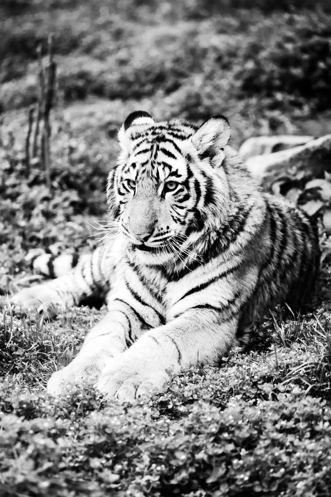

# 图像增强

## 简介

本项目实现了一套基于 Python 的图像数据增强工具集。通过多种增强技术扩展数据集，从而提升机器学习模型的训练性能。支持的增强方法包括旋转、亮度调整、对比度调整、锐化、裁剪、添加噪声、CutMix、翻转、透视变换、直方图均衡化等。

---
# augmentations.py

## 文件说明
`augmentations.py` 是项目的核心模块，集成了所有的图像增强方法并提供了统一的调用接口。通过定义增强流水线，可以将多种增强方法应用于输入图像，扩展数据集的多样性。

---

## 功能

1. **集成增强方法**  
   包括旋转、亮度调整、对比度调整、锐化、裁剪、添加噪声、CutMix、随机擦除、翻转、透视变换、直方图均衡化等。

2. **批量处理图像**  
   支持批量加载图像，对每张图像应用所有增强方法，并保存增强后的结果。

---

## 使用说明

### 函数
- **`process_dataset(input_dir, output_dir)`**  
  - 功能：对指定目录中的图像进行增强，并将结果保存到输出目录。
  - 参数：
    - `input_dir`：输入图像的目录。
    - `output_dir`：增强图像的保存目录。

---

# RUN_aug.py

## 文件说明
`RUN_aug.py` 是项目的主运行脚本，用于调用 `augmentations.py` 中的增强流水线，对指定的输入数据集批量生成增强图像。

---

## 功能

1. **调用增强流水线**  
   使用 `augmentations.py` 中定义的所有增强方法。

2. **目录参数化**  
   用户可以通过修改脚本中的变量设置输入和输出目录。

## 功能列表

1. **旋转 (Rotated)**  
   随机旋转图像。
   - 参数：
     - `min_angle`：最小旋转角度（默认值：`-180`）。
     - `max_angle`：最大旋转角度（默认值：`180`）。

2. **亮度调整 (Brightened)**  
   随机调整图像亮度。
   - 参数：
     - `min_factor`：最小亮度因子（默认值：`0.3`）。
     - `max_factor`：最大亮度因子（默认值：`3.0`）。

3. **对比度调整 (Contrasted)**  
   随机调整图像对比度。
   - 参数：
     - `min_factor`：最小对比度因子（默认值：`0.5`）。
     - `max_factor`：最大对比度因子（默认值：`1.5`）。

4. **锐化 (Sharpened)**  
   随机调整图像的锐度。
   - 参数：
     - `min_factor`：最小锐度因子（默认值：`0.5`）。
     - `max_factor`：最大锐度因子（默认值：`2.0`）。

5. **裁剪 (Cropped)**  
   随机裁剪图像。
   - 参数：
     - `min_crop_ratio`：最小裁剪比例（默认值：`0.5`）。
     - `max_crop_ratio`：最大裁剪比例（默认值：`0.9`）。

6. **添加噪声 (Noisy)**  
   向图像添加高斯噪声。
   - 参数：
     - `mean`：噪声均值（默认值：`0`）。
     - `std`：噪声标准差（默认值：`25`）。
   
   
7. **随机擦除 (RandomErased)**  
   随机擦除图像中的部分区域。
   - 参数：
     - `min_area`：擦除区域最小比例（默认值：`0.02`）。
     - `max_area`：擦除区域最大比例（默认值：`0.4`）。
     - `min_aspect`：最小宽高比（默认值：`0.3`）。
     - `max_aspect`：最大宽高比（默认值：`3.3`）。

8. **CutMix**  
   将两张图像随机混合。
   - 参数：
     - `alpha`：控制 `lambda` 的分布（默认值：`1.0`）。
     - `target_size`：输出图像的目标尺寸（默认值：`(256, 256)`）。
   
   
9. **随机翻转 (RandomFlipped)**  
   随机翻转图像（水平、垂直或同时翻转）。
   - 参数：无。

10. **透视变换 (Perspective)**  
    随机对图像应用透视变换。
    - 参数：
      - `max_warp`：最大形变比例（默认值：`0.4`）。
    
   
11. **直方图均衡化 (Equalized)**  
    提高图像对比度，通过均衡化像素分布增强细节。
    - 参数：无。
   
   
12. **Gamma 校正 (GammaCorrected)**  
    对图像应用 Gamma 校正，调整图像亮度。
    - 参数：
      - `gamma`：Gamma 值（默认值：`1.0`，大于 `1` 提高亮度，小于 `1` 降低亮度）。
   
   
13. **自定义卷积核滤波 (KernelFiltered)**  
    应用自定义卷积核进行图像处理（如锐化、模糊或边缘检测）。
    - 参数：
      - `kernel`：自定义卷积核矩阵（二维 `numpy` 数组）。
   
   
14. **PCA 抖动 (PCAJittered)**  
    使用 PCA 对图像进行色彩扰动。
    - 参数：
      - `alpha_std`：控制扰动强度的标准差（默认值：`3`）。
   
   
